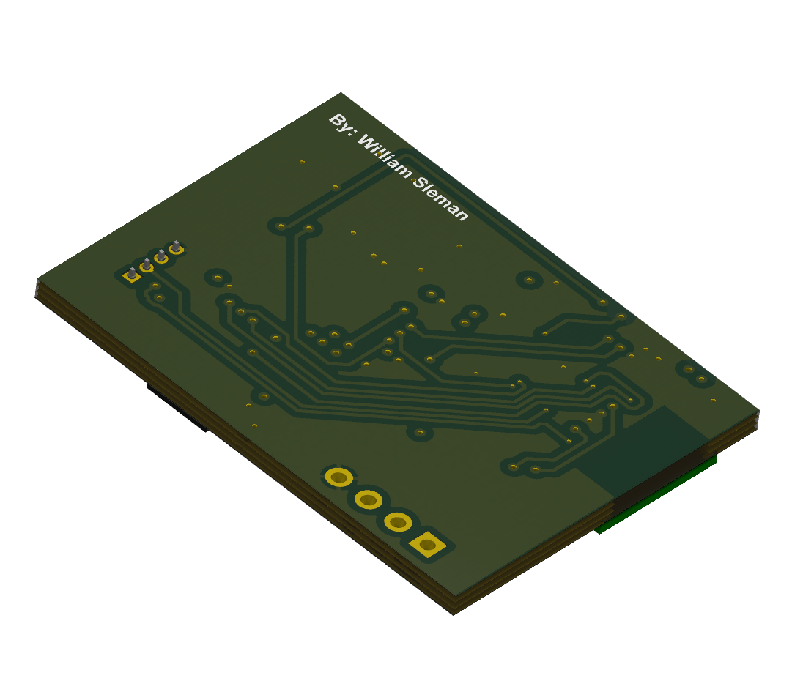

# Hardware

## Overview

In the hardware directory, have been designed a simple conception board for the data acquisition device. The design encompasses basic electronic components
meeded.

### Schematic

You can find the schematic for the hardware [here](Schematic/HW.pdf).

This schematic illustrates the connections and components used for this project. Feel free to explore and modify it as per your requirements.
