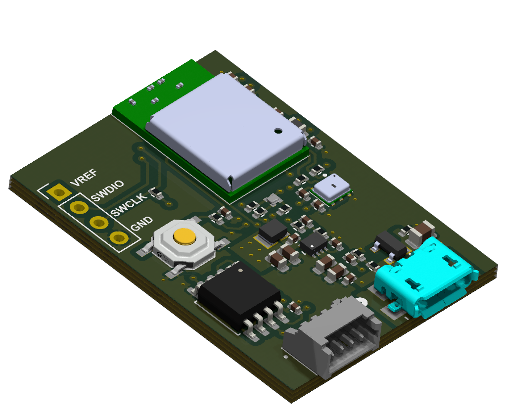

# NINA Project

## Overview

The NINA Project was developed to create a data acquisition device. This project is structured into two main directories: **hardware** and **firmware**.
Each section contains essential components for building and programming the device.

### Directories

- **[HARDWARE](HW/)**: Contains the hardware specifications and schematics.
- **[FIRMWARE](FW/)**: Contains the low-level driver implementations and application structure.

For further details, please refer to the specific READMEs in their respective directories.